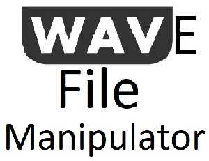

WaveFileManipulator is an open source .NET .wav file manipulation library written by [David Klempfner](https://medium.com/@DavidKlempfner)



## Features
* Reverse the audio
* Get the metadata into a handy model
* Use your own implementations

## Metadata
The metadata model includes the following:
* All canonical/standard .wav file format values
* Non standard INFO text segments
* Public constants so you know the start index for sections within the metadata


## Info
* You can see the INFO tags and values in the Metadata.Info property
* For more information about what these tags mean, see https://www.recordingblogs.com/wiki/list-chunk-of-a-wave-file

## NuGet Package
* This is available as a NuGet package: https://www.nuget.org/packages/WaveFileManipulator/

## Your Own Implementation
Want to try a different array reversing algorithm?
You can pass in your own implementation of IReverser into the Manipulator ctor.

## Examples
* Reverse the audio

```c#
using WaveFileManipulator;

class Program
{
    static void Main(string[] args)
    {
        var filePath = @"C:\File.wav";
        var manipulator = new Manipulator(filePath);
        var reversedByteArray = manipulator.Reverse();
        using (FileStream reversedFileStream = new FileStream(@"C:\ReversedFile.wav", FileMode.Create, FileAccess.Write, FileShare.Write))
        {
            reversedFileStream.Write(reversedByteArray, 0, reversedByteArray.Length);
        }
    }
}
```
* View the metadata, given a byte array
```c#
using WaveFileManipulator;

class Program
{
    static void Main(string[] args)
    {
        byte[] byteArray = GetBytesFromWaveFile();
        var metadata = new Metadata(byteArray);
    }
}
```
* View the metadata, given a file path
```c#
using WaveFileManipulator;

class Program
{
    static void Main(string[] args)
    {
        var filePath = @"C:\File.wav";
        var manipulator = new Manipulator(filePath);
        var metadata = manipulator.Metadata;        
    }
}
```
* Find the start index of a chunk
```c#
using WaveFileManipulator;

class Program
{
    static void Main(string[] args)
    {
        var audioFormatStartIndex = AudioFormat.StartIndex;    
    }
}
```
