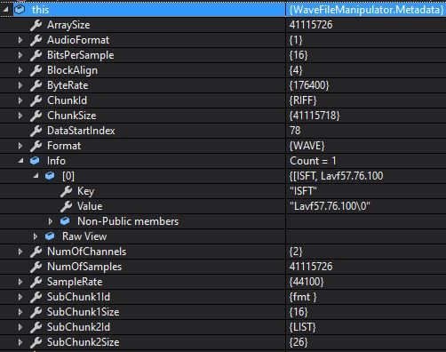

WaveFileManipulator is an open source .NET .wav file manipulation library written by [David Klempfner](https://medium.com/@DavidKlempfner)

## Features
* Reverse the audio
* Get the metadata into a handy model

## Metadata
The metadata model includes the following:
* All canonical/standard .wav file format values
* Non standard INFO text segments
* Public constants so you know the start index for sections within the metadata



## Examples
* Reverse the audio

```c#
using WaveFileManipulator;

class Program
{
    static void Main(string[] args)
    {
        var filePath = @"C:\File.wav";
        var manipulator = new Manipulator(filePath);
        var reversedByteArray = manipulator.Reverse();
        
                    using (FileStream reversedFileStream = new FileStream(@"C:\ReversedFile.wav", FileMode.Create, FileAccess.Write, FileShare.Write))
            {
                reversedFileStream.Write(reversedByteArray, 0, reversedByteArray.Length);
            }
    }
}
```
* View the metadata, given a byte array
```c#
using WaveFileManipulator;

class Program
{
    static void Main(string[] args)
    {
        byte[] byteArray = GetBytesFromWaveFile();
        var metadata = new Metadata(byteArray);
    }
}
```
* View the metadata, given a file path
```c#
using WaveFileManipulator;

class Program
{
    static void Main(string[] args)
    {
        var filePath = @"C:\File.wav";
        var manipulator = new Manipulator(filePath);
        var metadata = manipulator.Metadata;        
    }
}
```
